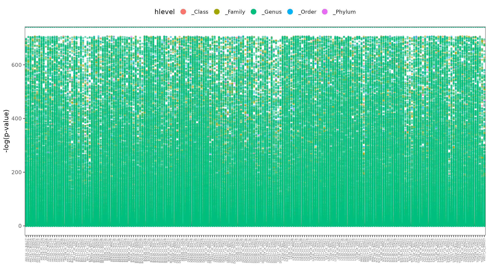
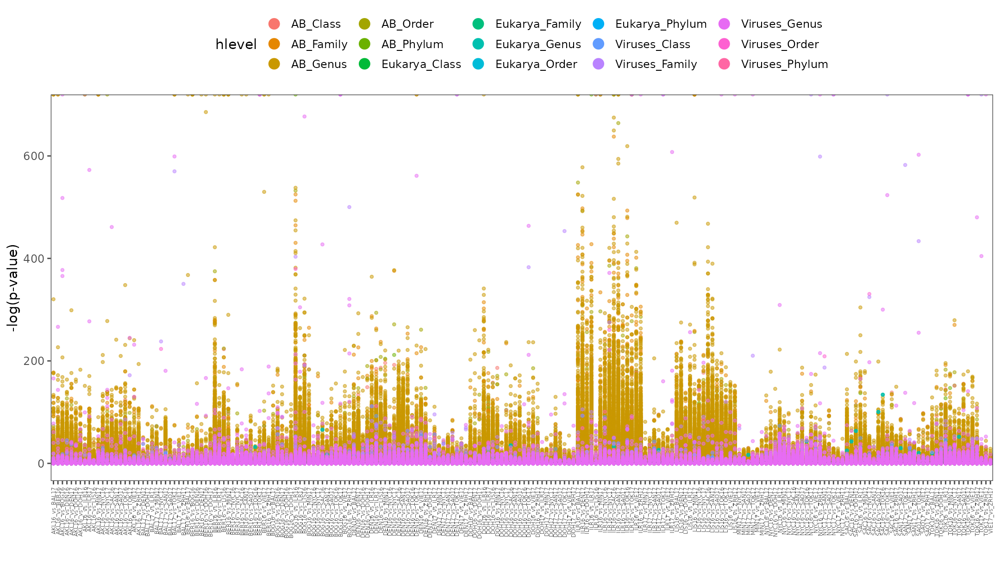

# Variable selection

Our goal is to select OTUs considering the possible zero inflated data and evaluate if this modeling has an impact in the forensic challenge of city prediction.

## Data preparation

First we are subsetting the complete OTU tables, both [reads](../01_preprocessing/taxonomy/read-biom.tsv.gz) and [assembly](../01_preprocessing/taxonomy/assembly-biom.tsv.gz), by 
Archaea and Bacteria, Eukarya, Virus, and the three kingdoms combined. 
For each of the subsetted datasets we agglomerated them at different taxonomic levels: Phylum, Class, Order, Family, and Genus. 
We thus obtained 40 different datasets, listed in the following tables:

- [OTU table from reads](https://github.com/ccm-bioinfo/cambda2023/blob/main/preprocessing/taxonomy/read-biom.tsv.gz)
  
|   |Bacteria-Archaea | Virus   | Eukarya  | All   |  
|---|---|---|---|---|  
|Phylum   | [Bacteria-Phylum](./02_variable_selection/data/reads/readsAB_count__Phylum.csv)  | [Virus-Phylum](./02_variable_selection/data/reads/readsViruses_count__Phylum.csv)   | [Eukarya-Phylum](./02_variable_selection/data/reads/readsEukarya_count__Phylum.csv)  | [All-Phylum](./02_variable_selection/data/reads/reads_count__Phylum.csv)   |   
|Family   | [Bacteria-Family](./02_variable_selection/data/reads/readsAB_count__Family.csv)  | [Virus-Family](./02_variable_selection/data/reads/readsViruses_count__Family.csv)   | [Eukarya-Family](./02_variable_selection/data/reads/readsEukarya_count__Family.csv)  | [All-Family](./02_variable_selection/data/reads/reads_count__Family.csv)   |   
|Class   | [Bacteria-Class](./02_variable_selection/data/reads/readsAB_count__Class.csv)  | [Virus-Class](./02_variable_selection/data/reads/readsViruses_count__Class.csv)   | [Eukarya-Class](./02_variable_selection/data/reads/readsEukarya_count__Class.csv)  | [All-Class](./02_variable_selection/data/reads/reads_count__Class.csv)   |   
|Order   | [Bacteria-Order](./02_variable_selection/data/reads/readsAB_count__Order.csv)  | [Virus-Order](./02_variable_selection/data/reads/readsViruses_count__Order.csv)   | [Eukarya-Order](./02_variable_selection/data/reads/readsEukarya_count__Order.csv)  | [All-Order](./02_variable_selection/data/reads/reads_count__Order.csv)   |   
|Genera   | [Bacteria-Genus](./02_variable_selection/data/reads/readsAB_count__Genus.csv)  | [Virus-Genus](./02_variable_selection/data/reads/readsViruses_count__Genus.csv)   | [Eukarya-Genus](./02_variable_selection/data/reads/readsEukarya_count__Genus.csv)  | [All-Genus](./02_variable_selection/data/reads/reads_count__Genus.csv)   |   

- [OTU table with assemblies](https://github.com/ccm-bioinfo/cambda2023/blob/main/preprocessing/taxonomy/assembly-biom.tsv.gz)  
  
|   |Bacteria-Archaea | Virus   | Eukarya  | All   |  
|---|---|---|---|---|  
|Phylum   | [Bacteria-As-Phylum](./02_variable_selection/data/assembly/assemblyAB_count__Phylum.csv)  | [Virus-As-Phylum](./02_variable_selection/data/assembly/assemblyViruses_count__Phylum.csv)   | [Eukarya-As-Phylum](./02_variable_selection/data/assembly/assemblyEukarya_count__Phylum.csv)  | [All-As-Phylum](./02_variable_selection/data/assembly/assembly_count__Phylum.csv)   |   
|Family   | [Bacteria-As-Family](./02_variable_selection/data/assembly/assemblyAB_count__Family.csv)  | [Virus-As-Family](./02_variable_selection/data/assembly/assemblyViruses_count__Family.csv)   | [Eukarya-As-Family](./02_variable_selection/data/assembly/assemblyEukarya_count__Family.csv)  | [All-As-Family](./02_variable_selection/data/assembly/assembly_count__Family.csv)   |   
|Class   | [Bacteria-As-Class](./02_variable_selection/data/assembly/assemblyAB_count__Class.csv)  | [Virus-As-Class](./02_variable_selection/data/assembly/assemblyViruses_count__Class.csv)   | [Eukarya-As-Class](./02_variable_selection/data/assembly/assemblyEukarya_count__Class.csv)  | [All-As-Class](./02_variable_selection/data/assembly/assembly_count__Class.csv)   |   
|Order   | [Bacteria-As-Order](./02_variable_selection/data/assembly/assemblyAB_count__Order.csv)  | [Virus-As-Order](./02_variable_selection/data/assembly/assemblyViruses_count__Order.csv)   | [Eukarya-As-Order](./02_variable_selection/data/assembly/assemblyEukarya_count__Order.csv)  | [All-As-Order](./02_variable_selection/data/assembly/assembly_count__Order.csv)   |   
|Genera   | [Bacteria-As-Genus](./02_variable_selection/data/assembly/assemblyAB_count__Genus.csv)  | [Virus-As-Genus](./02_variable_selection/data/assembly/assemblyViruses_count__Genus.csv)   | [Eukarya-As-Genus](./02_variable_selection/data/assembly/assemblyEukarya_count__Genus.csv)  | [All-As-Genus](./02_variable_selection/data/assembly/assembly_count__Genus.csv)   |   

This was done using [the code in this link](./codes/biom_to_counts_by_taxlevel.R).

## Identifying differential OTUs 

Under our approach selecting important variables is synonymous with identifying differentially abundant OTUs. 
Similarly to the DESeq2 library from R we consider regression models for count data, but instead of restricting ourselves to the Negative binomial model, we consider four models:

- Poisson (P) regression
- Negative binomial (NB) regression
- Zero inflated Poisson (ZIP) regression
- Zero inflated negative binomial (ZINB) regression

The last two models are used to account for a possible excess of zeros in the data. 

In what follows we will only refer to the reads data, but similar observations apply to the assembly data. 
Let us recall that the data consists of 365 metagenomic samples originally with 20448 OTUs, with around 55 % of the counts beign zeros. 
In the following table we present the number of OTUs present in the data after the agglomeration, with the number between parentheses representing the percentage of zeros:

|   | Bacteria-Archaea | Eukarya | Virus | All   |  
|---|---|---|---|---|
|Phylum | 53 (8.92) | 6 (63.65) | 17 (32.38) | 76 (18.49) |
|Family | 545 (6.35) | 7 (68.61) | 219 (74.63) | 771 (26.31) |
|Class | 112 (7.23) | 5 (72.82) | 38 (54.73) | 155 (20.99) |
|Order | 235 (5.44) | 6 (77.08) | 62 (62.06) | 303 (18.45) |
|Genera | 2023 (8.10) | 7 (68.61) | 1874 (83.83) | 3094 (44.56) |

We now describe the procedure we followed to select a collection of OTUs, of different taxonomic levels, that are deemed to be differentially abundant. 
Given one of the four possible models (for instance the Poisson), for every OTU (take Klebsciella with ID 570 as an example) and each pair of cities (say Denver 2016 and New York City 2017) using the city of origin of the sample as a dummy variable, we fit the model and record the p-value associated to the coefficient of said dummy variable. 
This procedure is done for each of the taxonomic levels previously presented. 
Additionally, even if the method was applied separately for each of the kingdoms, to select the variables we mixed the computed p-values, giving us a similar table to the one obtained when applying the procedure to all the kingdoms together, but with different results. 

As we simultaneously perform several hypothesis tests on different OTUs or AMRs, the probability of committing a type 1 error increases with the number of tests. To counter this tendency and avoid spurious discoveries, different methods can be used. One of the best known is the Bonferroni correction, where basically the base significance level is divided by the number of tests.  There are other more sophisticated alternatives such as the Tukey or Scheffe tests. In our case we decide to control the false discovery rate (FDR). The FDR is defined as the expected ratio between the number of false positive classifications (false discoveries) and the total number of positive classifications (rejections of the null hypothesis). A very popular methodology to control the FDR is the Benjamini-Hochberg procedure.

It goes as follows: 
1. For a given $\alpha$ , find the largest $k$ such that $\displaystyle P_{(k)}\leq {\frac {k}{m}}\alpha $. 
2. Reject the null hypothesis (i.e., declare discoveries) for all 
$H_{(i)}$ for $i = 1, \ldots, k$.

Alternatively to changing the rejection criterion, one can alter or adjust the associated p-values. In this way they can still be interpreted as evidence against the hypothesis. In the Bonferroni case one simply multiplies the p-value by the number of tests. The Benjamini & Hochberg case is a bit more complicated to express analytically, but the resulting p-values allow us to obtain a rejection criterion equivalent to the one described above for the desired $\alpha$. 

Here we show a couple of the obtained p-values. 
The computed p-values for the Poisson regression, when fitting with all kingdoms together, are shown in the next figure:

The computed p-values for the Negative binomial regression, when fitting the models separately for each kingdom, are shown next:

After computing the p-values, for each pair of cities we selected the 5 OTUs with the lowest recorded p-values. 
We believe that this will give us a reduced list of OTUs that will perform well for the forensic challenge of city classification. 

This procedure is coded in [variable_selection.R](./codes/variable_selection.R).

After computing the p-values we observed that there were many p-values equal to zero that had high AIC scores. 
Thus, for each OTU and each pair of cities, we selected the model that had the lowest AIC score and kept the p-value associated to that model. 
This prevents the presence of low p-values with bad fitting models. 

With the previous steps done, the tables with the selected data were constructed. 
In the next table we present the number of selected OTUs under each model, and the percentage of zeros in parentheses. 

|Model | Fit with all kingdoms | Fit kingdoms separately |
|---|---|---|
|P               | 15 (0.91)   | 16 (0.96)   |
|NB              | 280 (8.19)  | 294 (10.24) |
|ZIP             | 343 (11.85) | 305 (10.70) |
|ZINB            | 450 (29.94) | 428 (30.22) |
|Model selection | 298 (12.76) | 312 (11.94) |

This data was used for classification purposes. 
Up to June 26, the selected variables using the Negative binomial model, and the model selection, give F1 scores around 0.95. 
Hence, we think that this variable selection method is performing well with the benefit that the selected variables might be interpreted biologically. 
Indeed, for every selected OTU we know for which pairs of cities it is differential, so we might ask what are the biological reasons for this to happen. 

## The particular case of New York

As we suspect that the genomic samples of AMR profiles are from New York City, we focused our attention on the selected OTUs that are differential between New York City and other cities in USA. 

According the the [classification results](../03_classification/) we will be using the selected variables while using the Negative binomial model, fitted on the kingdoms separately. 
We present the corresponding OTUs as a table:

|     OTU|locs           |hlevel         | sign_rank[^1]|Kingdom  |Phylum                      |Class               |Order            |Family              |Genus                      |
|-------:|:--------------|:--------------|---------:|:--------|:---------------------------|:-------------------|:----------------|:-------------------|:--------------------------|
|     469|NYC16_vs_SAN17 |AB_Order       |         4|Bacteria |Pseudomonadota              |Gammaproteobacteria |Moraxellales     |NA                  |NA                         |
|     469|NYC16_vs_SAN17 |AB_Family      |         5|Bacteria |Pseudomonadota              |Gammaproteobacteria |Moraxellales     |Moraxellaceae       |NA                         |
|     565|DEN16_vs_NYC16 |AB_Genus       |         1|Bacteria |Pseudomonadota              |Gammaproteobacteria |Enterobacterales |Enterobacteriaceae  |Atlantibacter              |
|     565|NYC16_vs_BAL17 |AB_Genus       |         5|Bacteria |Pseudomonadota              |Gammaproteobacteria |Enterobacterales |Enterobacteriaceae  |Atlantibacter              |
|     565|NYC16_vs_DEN17 |AB_Genus       |         1|Bacteria |Pseudomonadota              |Gammaproteobacteria |Enterobacterales |Enterobacteriaceae  |Atlantibacter              |
|     565|NYC16_vs_SAN17 |AB_Genus       |         1|Bacteria |Pseudomonadota              |Gammaproteobacteria |Enterobacterales |Enterobacteriaceae  |Atlantibacter              |
|     566|DEN16_vs_NYC16 |AB_Genus       |         3|Bacteria |Pseudomonadota              |Gammaproteobacteria |Enterobacterales |Enterobacteriaceae  |Pseudescherichia           |
|     566|NYC16_vs_DEN17 |AB_Genus       |         4|Bacteria |Pseudomonadota              |Gammaproteobacteria |Enterobacterales |Enterobacteriaceae  |Pseudescherichia           |
|    1280|DEN16_vs_NYC17 |AB_Phylum      |         4|Bacteria |Bacillota                   |NA                  |NA               |NA                  |NA                         |
|    1280|DEN16_vs_NYC17 |AB_Class       |         5|Bacteria |Bacillota                   |Bacilli             |NA               |NA                  |NA                         |
|    1280|DEN16_vs_NYC17 |AB_Order       |         3|Bacteria |Bacillota                   |Bacilli             |Bacillales       |NA                  |NA                         |
|    1280|DEN16_vs_NYC17 |AB_Family      |         2|Bacteria |Bacillota                   |Bacilli             |Bacillales       |Staphylococcaceae   |NA                         |
|    1280|DEN16_vs_NYC17 |AB_Genus       |         1|Bacteria |Bacillota                   |Bacilli             |Bacillales       |Staphylococcaceae   |Staphylococcus             |
|    1280|BAL17_vs_NYC17 |AB_Genus       |         5|Bacteria |Bacillota                   |Bacilli             |Bacillales       |Staphylococcaceae   |Staphylococcus             |
|    1350|NYC16_vs_MIN17 |AB_Family      |         5|Bacteria |Bacillota                   |Bacilli             |Lactobacillales  |Enterococcaceae     |NA                         |
|    1350|NYC16_vs_MIN17 |AB_Genus       |         2|Bacteria |Bacillota                   |Bacilli             |Lactobacillales  |Enterococcaceae     |Enterococcus               |
|   28901|NYC17_vs_SAN17 |AB_Genus       |         5|Bacteria |Pseudomonadota              |Gammaproteobacteria |Enterobacterales |Enterobacteriaceae  |Salmonella                 |
|   29370|NYC16_vs_SAC16 |AB_Genus       |         2|Bacteria |Bacillota                   |Clostridia          |Eubacteriales    |Lachnospiraceae     |Lacrimispora               |
|   34062|NYC16_vs_SAC16 |AB_Genus       |         1|Bacteria |Pseudomonadota              |Gammaproteobacteria |Moraxellales     |Moraxellaceae       |Moraxella                  |
|   34062|NYC16_vs_MIN17 |AB_Genus       |         1|Bacteria |Pseudomonadota              |Gammaproteobacteria |Moraxellales     |Moraxellaceae       |Moraxella                  |
|   34062|MIN17_vs_NYC17 |AB_Genus       |         4|Bacteria |Pseudomonadota              |Gammaproteobacteria |Moraxellales     |Moraxellaceae       |Moraxella                  |
|   47671|SAC16_vs_NYC17 |AB_Genus       |         4|Bacteria |Pseudomonadota              |Betaproteobacteria  |Burkholderiales  |Burkholderiaceae    |Lautropia                  |
|   51665|NYC16_vs_MIN17 |AB_Genus       |         4|Bacteria |Bacillota                   |Bacilli             |Lactobacillales  |Aerococcaceae       |Aerococcus                 |
|   55206|DEN17_vs_NYC17 |AB_Genus       |         2|Bacteria |Spirochaetota               |Spirochaetia        |Spirochaetales   |Spirochaetaceae     |Sediminispirochaeta        |
|  119219|NYC16_vs_BAL17 |AB_Genus       |         3|Bacteria |Pseudomonadota              |Betaproteobacteria  |Burkholderiales  |Burkholderiaceae    |Cupriavidus                |
|  119219|NYC16_vs_DEN17 |AB_Genus       |         5|Bacteria |Pseudomonadota              |Betaproteobacteria  |Burkholderiales  |Burkholderiaceae    |Cupriavidus                |
|  131568|NYC16_vs_SAC16 |AB_Order       |         3|Bacteria |Actinomycetota              |Actinomycetes       |Kineosporiales   |NA                  |NA                         |
|  225148|BAL17_vs_NYC17 |AB_Family      |         3|Bacteria |Chlamydiota                 |Chlamydiia          |Parachlamydiales |Rhabdochlamydiaceae |NA                         |
|  225148|BAL17_vs_NYC17 |AB_Genus       |         4|Bacteria |Chlamydiota                 |Chlamydiia          |Parachlamydiales |Rhabdochlamydiaceae |Candidatus Rhabdochlamydia |
|  288000|NYC16_vs_BAL17 |AB_Family      |         2|Bacteria |Pseudomonadota              |Alphaproteobacteria |Hyphomicrobiales |Nitrobacteraceae    |NA                         |
|  288000|NYC16_vs_DEN17 |AB_Family      |         3|Bacteria |Pseudomonadota              |Alphaproteobacteria |Hyphomicrobiales |Nitrobacteraceae    |NA                         |
|  288000|NYC16_vs_BAL17 |AB_Genus       |         1|Bacteria |Pseudomonadota              |Alphaproteobacteria |Hyphomicrobiales |Nitrobacteraceae    |Bradyrhizobium             |
|  288000|NYC16_vs_DEN17 |AB_Genus       |         2|Bacteria |Pseudomonadota              |Alphaproteobacteria |Hyphomicrobiales |Nitrobacteraceae    |Bradyrhizobium             |
|  337051|SAC16_vs_NYC17 |Viruses_Order  |         1|Viruses  |Cossaviricota               |Papovaviricetes     |Zurhausenvirales |NA                  |NA                         |
|  337051|BAL17_vs_NYC17 |Viruses_Order  |         2|Viruses  |Cossaviricota               |Papovaviricetes     |Zurhausenvirales |NA                  |NA                         |
|  337051|MIN17_vs_NYC17 |Viruses_Order  |         1|Viruses  |Cossaviricota               |Papovaviricetes     |Zurhausenvirales |NA                  |NA                         |
|  337051|NYC17_vs_SAN17 |Viruses_Order  |         1|Viruses  |Cossaviricota               |Papovaviricetes     |Zurhausenvirales |NA                  |NA                         |
|  337051|SAC16_vs_NYC17 |Viruses_Family |         2|Viruses  |Cossaviricota               |Papovaviricetes     |Zurhausenvirales |Papillomaviridae    |NA                         |
|  337051|BAL17_vs_NYC17 |Viruses_Family |         1|Viruses  |Cossaviricota               |Papovaviricetes     |Zurhausenvirales |Papillomaviridae    |NA                         |
|  337051|MIN17_vs_NYC17 |Viruses_Family |         2|Viruses  |Cossaviricota               |Papovaviricetes     |Zurhausenvirales |Papillomaviridae    |NA                         |
|  337051|NYC17_vs_SAN17 |Viruses_Family |         2|Viruses  |Cossaviricota               |Papovaviricetes     |Zurhausenvirales |Papillomaviridae    |NA                         |
|  861445|DEN16_vs_NYC16 |AB_Genus       |         5|Bacteria |Pseudomonadota              |Gammaproteobacteria |Moraxellales     |Moraxellaceae       |Psychrobacter              |
| 1349409|NYC16_vs_SAN17 |Viruses_Genus  |         3|Viruses  |                            |                    |                 |                    |Pandoravirus               |
| 1528099|NYC17_vs_SAN17 |AB_Family      |         4|Bacteria |Actinomycetota              |Actinomycetes       |Mycobacteriales  |Lawsonellaceae      |NA                         |
| 1658671|DEN16_vs_NYC16 |AB_Genus       |         4|Bacteria |Actinomycetota              |Actinomycetes       |Micrococcales    |Intrasporangiaceae  |Arsenicicoccus             |
| 1882682|NYC16_vs_SAC16 |AB_Genus       |         4|Bacteria |Pseudomonadota              |Alphaproteobacteria |Hyphomicrobiales |Methylobacteriaceae |Microvirga                 |
| 1982251|NYC16_vs_SAN17 |Viruses_Genus  |         2|Viruses  |Uroviricota                 |Caudoviricetes      |                 |                    |Pahexavirus                |
| 1982251|NYC17_vs_SAN17 |Viruses_Genus  |         3|Viruses  |Uroviricota                 |Caudoviricetes      |                 |                    |Pahexavirus                |
| 2086471|SAC16_vs_NYC17 |AB_Genus       |         5|Bacteria |Bacteroidota                |Cytophagia          |Cytophagales     |Hymenobacteraceae   |Adhaeribacter              |
| 2560685|SAC16_vs_NYC17 |Viruses_Genus  |         3|Viruses  |Uroviricota                 |Caudoviricetes      |                 |                    |Otagovirus                 |
| 2713640|DEN17_vs_NYC17 |Viruses_Phylum |         3|Viruses  |Artverviricota              |NA                  |NA               |NA                  |NA                         |
| 2713640|DEN17_vs_NYC17 |Viruses_Class  |         4|Viruses  |Artverviricota              |Revtraviricetes     |NA               |NA                  |NA                         |
| 2713640|DEN17_vs_NYC17 |Viruses_Family |         5|Viruses  |Artverviricota              |Revtraviricetes     |Ortervirales     |Caulimoviridae      |NA                         |
| 2713640|DEN17_vs_NYC17 |Viruses_Genus  |         1|Viruses  |Artverviricota              |Revtraviricetes     |Ortervirales     |Caulimoviridae      |Cavemovirus                |
| 2731985|DEN16_vs_NYC16 |Viruses_Genus  |         2|Viruses  |Uroviricota                 |Caudoviricetes      |                 |Autographiviridae   |Tritonvirus                |
| 2899133|MIN17_vs_NYC17 |AB_Phylum      |         5|Bacteria |Candidatus Saccharibacteria |NA                  |NA               |NA                  |NA                         |
| 2936682|NYC16_vs_BAL17 |AB_Genus       |         4|Bacteria |Bacillota                   |Bacilli             |Bacillales       |Bacillaceae         |Lysinibacillus             |
| 2936682|NYC16_vs_MIN17 |AB_Genus       |         3|Bacteria |Bacillota                   |Bacilli             |Bacillales       |Bacillaceae         |Lysinibacillus             |
| 2956463|MIN17_vs_NYC17 |Viruses_Genus  |         3|Viruses  |Uroviricota                 |Caudoviricetes      |                 |                    |Skogvirus                  |
| 2994664|NYC16_vs_SAC16 |AB_Genus       |         5|Bacteria |Actinomycetota              |Actinomycetes       |Micrococcales    |Microbacteriaceae   |Frigoribacterium           |
[^1]: The variable "sign_rank" corresponds to the place in the ranking of lowest p-values.

The first thing one notices is that there are repeated OTUs that correspond to different taxonomic levels. 
This is a byproduct of the way `phyloseq` does the agglomeration of variables. 
Nonetheless, it is remarkable that most of the time, when an OTU is present for at least two different taxonomic levels, it is differential for the same pair of cities. 
In particular this leads to ask ourselves if we can further reduce the number of selected OTUs, keeping only one of the taxonomic levels if nesting is present. 

## Revisiting differential OTUs

After exploring the differential OTUs for NYC against other cities in USA, we decided to reduce even more the number of selected OTUs. 
To achieve this, we analysed the selected OTUs for each pair of cities, and if one was repeated (at different taxonomic levels), we only retained the one at the lowest taxonomic level. 
For example, for the OTU with ID 469, which appears twice, once at Order and once at Family, we kept the one at the Order rank. 
We automatized this procedure and constructed the [reduced integrated tables](./selected_variables_results/integrated_reduced_tables/) for every one of the constructed tables using the different count models. 

To show that we indeed reduced the number of selected OTUs, we present the analogous to the last table presented in the _Identifying differential OTUs_ section, but considering the selection according to the taxonomic level. 
With this extra step, the number of selected OTUs (and corresponding percentage of zeros) is presented next:

|Model | Fit with all kingdoms | Fit kingdoms separately |
|---|---|---|
|P               | 15 (0.91)   | 16 (0.96)   |
|NB              | 242 (9.15)  | 258 (11.30) |
|ZIP             | 331 (11.42) | 294 (10.49) |
|ZINB            | 405 (31.39) | 401 (31.10) |
|Model selection | 258 (13.81) | 272 (12.91) |

Except for the OTUs selected with the Poisson regression approach, we see that there are selected less OTUs present. 

It remains to check if this reduction keeps the good performance for classification that the original selection presented. 

## Structure of the folder

Within this folder there are 6 subdirectories:

- [codes](./codes/): Here we have the codes used to create the OTUs tables agglomerated by taxonomic level, and the selection of variables done with generalized linear models.
- [CodigoLeticia](./CodigoLeticia/): In this folder there are codes and slides for compositional data analysis, and an introduction to the zero inflated negative models.
- [CodigoMario](./CodigoMario/): An introduction to Bayesian theory and some implementations with R.
- [data](./data/): The OTUs tables generated for different taxonomic labels are here.
- [KEE](./KEE): Stading for Klebscillia-Escherichia-Enterobacter, here are two tables that sum up the number of times these genera are read in each sample.
- [selected_variables_results](./selected_variables_results/): The results for the variable selection process are stored here.
