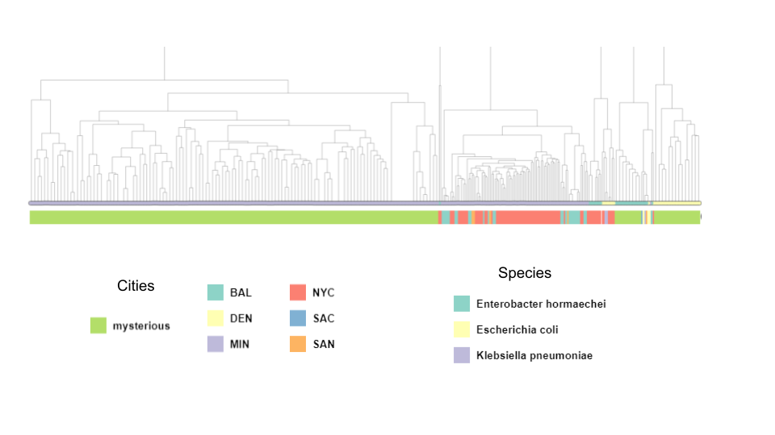

## Results on AMR analysis    
[MicroReact Dendogram with AMR metadata](https://microreact.org/project/mv3PRaax1TNsNseKzZUQnF-230626amrcamda) with this 
[Google Metadata](https://docs.google.com/spreadsheets/d/1ekyUCvOw7xsR7W72utqS8jcUH7129EBPvX4dSnnKekw/edit?usp=sharing) using 
[Newick Tree](data/230626_Full_Newick.nwk) 
  
###
- [Pangenomes](readme_pangenoma.md) (extra genomes)     
- [Extraction by Taxonomy - Binning by city - Assembly - AMR prediction](resultsReadsKrakenAssemblyBLAST.md)  (smaller contigs)  
- [Binning by City - Assembly - Extraction by taxonomy - AMR prediction](readmeCoassemblyByCity_AMR_Taxonomy.md
) (longer contigs)  
## Data 
- [Mysterious sample all markers](data/amr_mistery_table20230622_aroIds.tsv) 
- Kraken2-Extraction by Organism-binning by city-assembly   
  Alnitak  /data/camda2023/extraction/assemblies/*.fasta
    
  [ X ] [CARD](data/extraction-card-presence-anton-20230621.tsv)  
  [ x ] [Blastn](data/amr_counts_complement_20230621.tsv)  [Notebook to produce joined table](codigos/230622_AMR_JoinCARD-blastn.ipynb)  
  [ x ] [Table with rows of mysterious samples combined with US samples eliminating extra rows from CARD and from blast (505 rows)](data/230622_AMR_mysterious_ETBC_all_nelly.csv)  
  This table would be replaced since we might have misplaced species labels in US samples  
  
- Binning by city-Assembly-  
  Alnitak  /data/camda2023/us-cities/assemblies/*.fasta    
  [] Kraken2  
  [] Blastn  
  [] CARD
   
## AMR processing
We discovered that from the 505 AMR Ids markers from the mysterious file, only 180 were predicted using CARD v.XX over the assembled reads from US cities.  To comprehend the missing 325 markers, we gathered our own [manually curated AMR gene list](https://docs.google.com/spreadsheets/d/1ThsVn6QuIEPvFqe_SwG1PawEghqHgQdvNgGiZd40jXY/edit?usp=sharing)
 by searching the IDs in the following databases 
- [microbigg-e](https://www.ncbi.nlm.nih.gov/pathogens/microbigge/#)  
- [CARD](https://card.mcmaster.ca/)    
- [bv-brc](https://www.bv-brc.org/view/SpecialtyGeneList/)    
- [pathogenes-refgene](https://www.ncbi.nlm.nih.gov/pathogens/refgene/)   
- [NCBI-gene](https://www.ncbi.nlm.nih.gov/gene)  

 
  
Figure 1 Manually curated AMR database, 180 CARD genes, 325 other databases    
  
  
Figure 2. Workflow to produce AMR sample profiles.    

  
Figure 3 Example of sample-profile    

Table1 Ids that maybe SNPs  
| Gen1  | Function   | Organism   | Gen2   | Function2   | Organims2 |  
|---|---|---|---|---|---|  
| chuX  | ChuY has been shown to function as an anaerobilin reductase in a role that parallels biliverdin reductase  |   |shuX  |   |   |  
| chuY |   |    |shuY   |   |   |  
| chuZ  |   |   |shuZ   |   |   |  
| fliG  |   |   |fliI  |   |   |  
| iucA |   |    |iucC   |   |   |  
| papB  |   |   |sfaB   |   |   | 
| papI  |   |   |sfaC  |   |   |  
| rmpA |   |    |rmpA2   |   |   |  
| sfaD  |   |   |SfaG   |   |   |   
  
Ids that maybe variants  
| Gen1  | Function   | Organism   | Gen2   | Function2   | Organims2 |  
|---|---|---|---|---|---|  
| oxqA[3,6,8,10,11]  |   |   |oxqA  |   |   |  
| oxqB[5,9,14,19,20,22,24,25,32]  |   |   |oxqA  |   |   |   

Table 3 Ids that were not found  
| Gen  | Orgnism   | Problem   |   
|---|---|---|  
|papg-iii	|escherichia coli|		INVESTIGAR DIFERENCIA III vs II|  
|ec-148|	escherichia coli |NOT FOUND|  
|fimk	|klebsiella pneumoniae	|	NOT FOUND|  
|oqxr	|enterobacter hormaechei		|NOT FOUND|  
|shvl-64	|klebsiella pneumoniae	|	not found|  
|svhl-71	|klebsiella pneumoniae	|	NOT FOUND|  
|tcpc_group-2	|escherichia coli	|	NOT FOUND|  
|teml-100	|klebsiella pneumoniae|		NOT FOUND|  
|tle1|	klebsiella pneumoniae|		NOT FOUND|  
|vactox|	escherichia coli	|	NOT FOUND|  
|wcly	klebsiella |pneumoniae		NOT FOUND|  
|wcst	klebsiella |pneumoniae		NOT FOUND|  

To do :
- [ ] Diana Produce a heatmap with blast comparison for the variants of oxqB/A, with six sequences of each numerical group. Describe Table 2.   
- [ ] Fonty, i) document script order to end with a reproducible workflow (data assemblies will change).  ii) Add a column with the number of contigs per sample. This number will help us to normalize abundances for sample for the marker.  
- [ ] Nelly and Johan Reduce cases for Table1 and Table3.  
- [ ] Shaday Finish bins 
- [ ] Anton finishes output files for reads.  

----------------------------------------------------------------------------
**Modelos de clasificación**

Se cuenta con dos tablas de información:
- OTUS: relative_order_assembly.csv
- Genes counts: amr-counts_card_info_20230604.tsv y amr_counts_complete_20230606.tsv

Se implementaron varios métodos de clasificación haciendo los siguientes pasos:

1- Preproceso
   Para los datos de OTUS, se consideró la tabla completa (365 muestras, 633 variables) estandarizando los datos solamente.
   Se realizó una selección de variables con 3 métodos:
   - Random forests usando como criterio la reducción de impureza con el indice de Gini, obteniendo 150 y 100 variables (Camda_ID_city_reduce_features.ipynb)
   - Recursive feature elimination (RFE) y con validación cruzada (RFECV), obteniendo 150, 100 y 24 (RFECV) variables (Camda_ID_city_reduce_features.ipynb).
   
   Para los datos de conteos, se consideró una representación "bolsa de genes" con pesos TF-IDF (term frecuency, inverse document frequency), y se usaron dos métodos para obtener representaciones vectoriales específicas para matrices sparse:
   - Truncated SVD, obteniendo 150 y 100 componentes (Camda_resistencia_amr_counts.ipynb)
   - Non-Negative Matrix Factorization (NMF), obteniendo 150 y 100 componentes (Camda_resistencia_amr_counts.ipynb)
   
 2- Clasificación.
   Se usaron clasificadores basados en random forests (RF), gradient boosting (XGBoost) y redes neuronales (NNET). Estos se ajustaron usando las bases de datos preprocesadas en el paso anterior:
   
   - $X$: OTUS, $y$: City
   - $X$: Gene counts, $y$: City
   - $X$: OTUS y Gene counts, $y$: City
   - $X$: OTUS reducido, $y$: City [por hacer]
   - $X$: OTUS reducido y Gene counts, $y$: City [por hacer]
   
  Hasta ahora, los mejores resultados se obtuvieron con XGBoost ajustado con GridSearch y validación cruzada:
|        | precision |  recall | f1-score |  support |
|---|---|---|---|---|
|    0  |     0.00  |    0.00  |    0.00    |     3 |
|    1  |     0.67  |    0.67  |    0.67    |     3 |
|    2  |     0.60  |    1.00  |    0.75    |     3 |
|    3  |     1.00  |    1.00  |    1.00    |     3 |
|    4  |     0.75  |    1.00  |    0.86    |     9 |
|    5  |     1.00  |    0.50  |    0.67    |     6 |
|    6  |     1.00  |    0.71  |    0.83    |     7 |
|    7  |     0.50  |    0.67  |    0.57    |     3 |
|    8  |     1.00  |    1.00  |    1.00    |     1 |
|    9  |     0.64  |    1.00  |    0.78    |     9 |
|   10  |     1.00  |    0.33  |    0.50    |     3 |
|   11  |     1.00  |    0.67  |    0.80    |     3 |
|   12  |     0.83  |    1.00  |    0.91    |     5 |
|   13  |     0.75  |    0.90  |    0.82    |    10 |
|   14  |     0.50  |    0.33  |    0.40    |     3 |
|   15  |     0.00  |    0.00  |    0.00    |     3 |
|---|---|---|---|---|
|    accuracy |           |           |    0.74  |      74 |
|   macro avg |      0.70 |     0.67  |    0.66  |      74 |
| weighted avg |      0.73 |     0.74 |     0.71 |       74 |
       
Por hacer, hay varias cosas:

- [ ] Hacer más pruebas con los métodos de reducción de variables para encontrar el conjunto óptimo. 
- [ ] Probar con algunos métodos de reducción de dimensión para los OTUS (Kernel PCA y UMAP: Uniform Manifold Approximation and Projection for Dimension Reduction)
- [ ] Hacer la selección de modelos de clasificación con Grid Search y Cross-validation. Esto requiere muchos recursos de cómputo (tiempo y procesamiento)
- [ ] Usar un enfoque de AutoML (automated machine learning, Plonska et al., 2021) para encontrar un ensamble de clasificadores que incluye su hiperparametrización y oprimización de parámetros.
