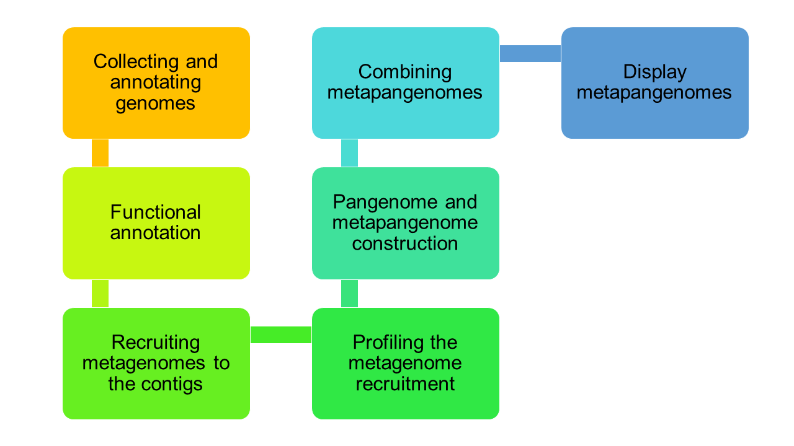
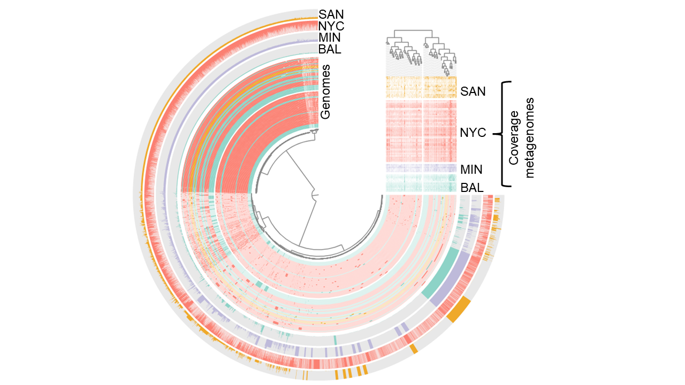

# Metapangenomics
The CAMDA 2023 team has decided to create a meta pangenome for the bacterial genus: _Escherichia_, _Klebsiella_, and _Enterobacter_. The following approach follows the ideas presented in [2020 by Utter, et al](https://genomebiology.biomedcentral.com/articles/10.1186/s13059-020-02200-2#Bib1).
Next, we will list the steps to replicate this research work.

This a tutorial for create a metapangenomics of Klebsiella pneumoniae to CAMDA 2023 was guided by Metapangenomics of Rothia and H. parainfluenzae.
## Organization & Workflow

  
Software.
You need the next bioinformatics software to recreate the metapagenomics:
- anvi’o 7.1 version
- Prodigal
- InterProScan (version 5.30-69)
- Bowtie2
- BLASTP
- MUSCLE
## Step 1. Collecting and annotating genomes.
Getting the genomes from the list filtered by Team Antón. 
In order to obtain the genomes during the CAMDA2023 Hackathon, Antó's team searched for Klebsiella genomes that were sequenced in the USA in 2016 and 2017. A total of 90 genomes were later downloaded to the Alnitak cluster. However, they were downloaded in '.gbk' and for this analysis it must be started with '.fasta' files, so it was decided to download it with the script that was provided to me by the tutorial by Daniel Utter et al. The first thing to do is obtain a list of all the genomes available at NCBI which is available at the following link: ftp://ftp.ncbi.nlm.nih.gov/genomes/ASSEMBLY_REPORTS/
Subsequently, use the download script MASTER_SCRIPTS/01GetGen.sh which has been slightly modified to download the klebsiella genomes previously listed by Antón's team. The original script is available in the tutorial by Daniel Utter et al. 
## Step 2. Functional annotation.
Functional annotation was performed using the InterProscan Database. This part of the analysis was carried out in the Chihuil cluster since alnitak did not have InterProscan installed, take into account that this step was carried out with the InterProscan installation that was installed locally (Installation made by Miguel CCM), since if you do With the InterProscan environment, it is likely that you will have errors because the DBs are not updated. In this step, a file called “interpro-results-fmt-Klebsiella-isolates.tsv” is created, which contains all the functional annotations of the Klebsiella genomes. You can consult the script to generate the functional annotations in MASTER_SCRIPT/99_geneFunctions.sh
## Step 3. Mapping. 
Recruiting metagenomes to the contigs.
This step aims to search for reads that align with the Klebsiella genomes. We want this so that we can know which are the genes that are most represented in the niche that we are investigating. These analyzes were carried out with the following script: MASTER_SCRIPTS/03ProMeRe.sh
## Step 4. Profiling the metagenome recruitment

## Step 5. Pangenome and metapangenome construction
Pangenome creation methods details
Metapangenome detailed assumptions and specifics
Precise choice of ECG/EAG threshold has little impact
## Step 6. Combining metapangenomes
## Anvi’o interactive display choices for metapangenomes
 
## Pangenomics  
A pangenome with genomic data of genera  _Escherichia_, _Klebsiella_, and _Enterobacter_ from the US cities in the challenge, with samples collected near 2017 can extend information about genes with antibiotic resistance. NCBI Genomes, see [Genomes Table](data/genome-metadata.csv) from the selected dates and places were downloaded and AMR annotated.
- [] [extra genomes blast AMR counts ](data/230624_genomes_blast_counts.tsv)
- [] [extra genomes CARD AMR annotation](data/230623_genomes_card_counts.tsv)  
- [] Full table  

# Pangenome

We constructed a pangenome with the genomes that are in `/data/camda2023/genomes/.gff`. 
We use ppanggolin because is the time to compute the pangenome with large database of genomes is minimum compared with anvi-o and get_homologues.

We run the following comands in the directory `/home/haydee/camda2023/ppanggolin2/`:

~~~
ppanggolin cluster --pangenome pangenome.h5 --cpu 8
ppanggolin graph --pangenome pangenome.h5 --cpu 8
ppanggolin partition --pangenome pangenome.h5 --cpu 8
ppanggolin rgp --pangenome pangenome.h5 --cpu 8
ppanggolin write -p pangenome.h5 --regions --output rgp
ppanggolin spot --pangenome pangenome.h5 --cpu 8
ppanggolin write -p pangenome.h5 --spots --output spots
ppanggolin write -p pangenome.h5 --stats --output statistics
ppanggolin draw --pangenome pangenome.h5 --ucurve --output draw_ucurve
ppanggolin draw --pangenome pangenome.h5 --tile_plot --output draw_tile
ppanggolin draw --pangenome pangenome.h5 --tile_plot --nocloud --output draw_tile_nocloud
ppanggolin write -p pangenome.h5 --gexf --output gexf
ppanggolin write -p pangenome.h5 --json --output graph
ppanggolin write -p pangenome.h5 --Rtab --output pres-abs
ppanggolin write -p pangenome.h5 --csv --output matrix
ppanggolin write -p pangenome.h5 --partitions --output partitions
ppanggolin write -p pangenome.h5 --projection --output projection
ppanggolin write -p pangenome.h5 --families_tsv --output families
~~~
{: .language-bash}

To obtain the genes associated to each partition we run:

`ppanggolin fasta -p pangenome.h5 --output Persistent_Genes --genes persistent`
`ppanggolin fasta -p pangenome.h5 --output Cloud_Genes --genes cloud`
`ppanggolin fasta -p pangenome.h5 --output Shell_Genes --genes shell`

Also we obtain the proteins:

`ppanggolin fasta -p pangenome.h5 --output Shell_Protein --prot_families shell`
`ppanggolin fasta -p pangenome.h5 --output Cloud_Protein --prot_families cloud`
`ppanggolin fasta -p pangenome.h5 --output Persistent_Protein --prot_families persistent`

## Blast

First we add the identifier to each gene in each of the files `cloud_genes.faa`, `persistent_genes.faa` and `shell_genes.faa` that we obtain with ppanggolin. To do this, we use vi to replace `>` by `>cloud|`, `>persistent|` and `>shell|`.

We run blast with the table [`missingAmr_20230606_with_species.fasta`](https://github.com/ccm-bioinfo/cambda2023/blob/main/06_amr_resistance/codigos/data_preparation/data/missingAmr_20230606_with_species.fasta) as `query`.

We use the parameter from script [blastScript.sh](https://github.com/ccm-bioinfo/cambda2023/blob/main/06_amr_resistance/codigos/data_preparation/blastScript.sh)

~~~
mkdir tblastx_all/cloud/database
mkdir tblastx_all/cloud/output
mkdir tblastx_all/persistent/database
mkdir tblastx_all/persistent/output
mkdir tblastx_all/shell/database
mkdir tblastx_all/shell/output
~~~
{: language-bash}

`makeblastdb -in cloud_genes.fna -dbtype nucl -out tblastx_all/cloud/database/cloud_genes`

`tblastx -query missingAmr_20230606_with_species.fasta -db tblastx_all/cloud/database/cloud_genes -outfmt "7 qacc sacc qlen slen qcovs length pident" > tblastx_all/cloud/output/missingAmr_vs_cloud.blast`

`makeblastdb -in persistent_genes.fna -dbtype nucl -out tblastx_all/persistent/database/persistent_genes`

`tblastx -query missingAmr_20230606_with_species.fasta -db tblastx_all/persistent/database/persistent_genes -outfmt "7 qacc sacc qlen slen qcovs length pident" > tblastx_all/persistent/output/missingAmr_vs_persistent.blast`

`makeblastdb -in shell_genes.fna -dbtype nucl -out tblastx_all/shell/database/shell_genes`

`tblastx -query missingAmr_20230606_with_species.fasta -db tblastx_all/shell/database/shell_genes -outfmt "7 qacc sacc qlen slen qcovs length pident" > tblastx_all/shell/output/missingAmr_vs_shell.blast`

## Parse blast-outputs

We use the script [parse_blast.py](https://github.com/ccm-bioinfo/cambda2023/blob/main/06_amr_resistance/codigos/data_preparation/parse_blast.py)

First, we separate the output of blast in files with just one genome.

`cat /data/camda2023/genomes/genome-metadata.csv |cut -d',' -f1 |while read line; do grep $line missingAmr_vs_cloud.blast >$line.blast ; done`

`cat /data/camda2023/genomes/genome-metadata.csv |cut -d',' -f1 |while read line; do grep $line missingAmr_vs_persistent.blast >$line.blast ; done`

`cat /data/camda2023/genomes/genome-metadata.csv |cut -d',' -f1 |while read line; do grep $line missingAmr_vs_shell.blast >$line.blast ; done`

The we use the following to create the scripts for each of the previous files:

`ls *1.blast | while read line; do echo $line; cp parse_blast.py parse_blast_${line}.py; perl -p -i -e 's/SUSTITUIR1/'"$line"'/' parse_blast_${line}.py ; perl -p -i -e 's/SUSTITUIR2/temp_'"${line}"'/' parse_blast_${line}.py ; perl -p -i -e 's/SUSTITUIR3/output_'"${line}"'\.tsv/' parse_blast_${line}.py ; done`

Finally, we run all the scripts.

`ls *1.blast.py | while read line; do python $line; done`

All the outputs can be found in the followings directory:

`/home/haydee/camda2023/tblastx_all/cloud/output/output*.tsv`  
`/home/haydee/camda2023/tblastx_all/persistent/output/output*.tsv`  
`/home/haydee/camda2023/tblastx_all/shell/output/output*.tsv`  

Genome Ids and Pangenome subset were added to blast files with the following line: 
`cd shell`
`ls |while read line; do id=$(echo $line|cut -d'_' -f3|cut -d'.' -f1); echo $id; perl -p -i -e 's/^/'"$id"'\tshell\t/' *$id*tsv; done`  
  
Then we only kept results lines in each file, ridding heders appart.   (Example in shell)   
 `ls o*tsv |while read line; do tail -n +2 $line; done > shell_genomes_blast.tsv`

 Headers were obtained by `head -n1 output_GCF_002214205.1.blast.tsv >header.tsv` The file selection is irrelevant since all headers are equal.  
 
After running the same command in the cloud and persistent directories, outputs were concatenated with:
`cat cloud/header.tsv cloud/cloud_genomes_blast.tsv shell/shell_genomes_blast.tsv persistent/persistence_genomes_blast.tsv  > 230624_genomes_blast_counts.tsv`

And finally counts are available at [blast Genomes Table](data/230624_genomes_blast_counts.tsv)  

