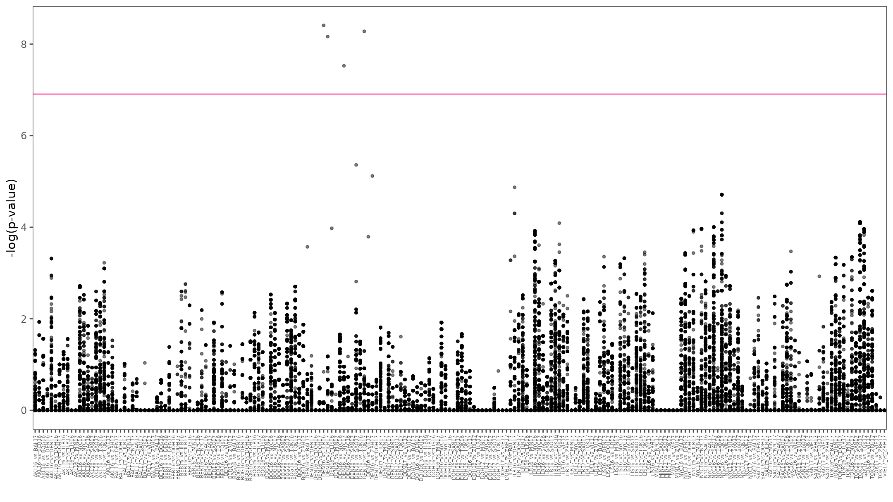

# Variable selection

Using the same principle that was used to [select differentially abundant OTUs by pairs of cities](../02_variable_selection/) we used a logistic regression model to identify differential markers by pairs of cities considering [presence-absence data for AMR markers](../01_preprocessing/amr/amr-presence.tsv). 

For completeness let us recall the variable selection method. 
The data comprises 365 metagenomic samples, where each sample consists of 2799 entries, being 1 if a marker was found in that sample and 0 otherwise. 
For each marker, say macB, and each pair of cities, for instance Denver 2016 and New York City 2017, a logistic regression that considered the cities as dummy variables was fitted. 
We then recorded the p-value of the coefficient that pertains to the dummy variable, which is a naive way to measure the difference caused by changing cities. 
The code to do this procedure [is in here](../02_variable_selection/codes/variable_selection_binary.R).

The obtained p-values is shown graphically (considering a -log transformation) in the following figure: 

For each pair of cities we selected the 5 markers that had the lowest p-value (the highest points in the previous image).  
Following the results in the OTU selection, we think that this will help us select a subset of variables that are useful in classification and prediction.  
The selected markers [can be found in this link](../02_variable_selection/selected_variables_results/significant_amr/amr_signif.csv).

The data with only the selected variables [is here](../02_variable_selection/selected_variables_results/reduced_tables/amr_reduced.csv). 
A summary of the variable reduction is shown next:

|   | [Original data](../01_preprocessing/amr/amr-presence.tsv) | [Reduced data](../02_variable_selection/selected_variables_results/reduced_tables/amr_reduced.csv) |
|---|---|---|
|Number of markers| 2799 | 243 |
|Percentage of zeros| 82 % | 49 % |

## TO-DO

- [ ] Run the model to the non-CARD data.
- [ ] Get the list of differential markers for only the USA cities.
