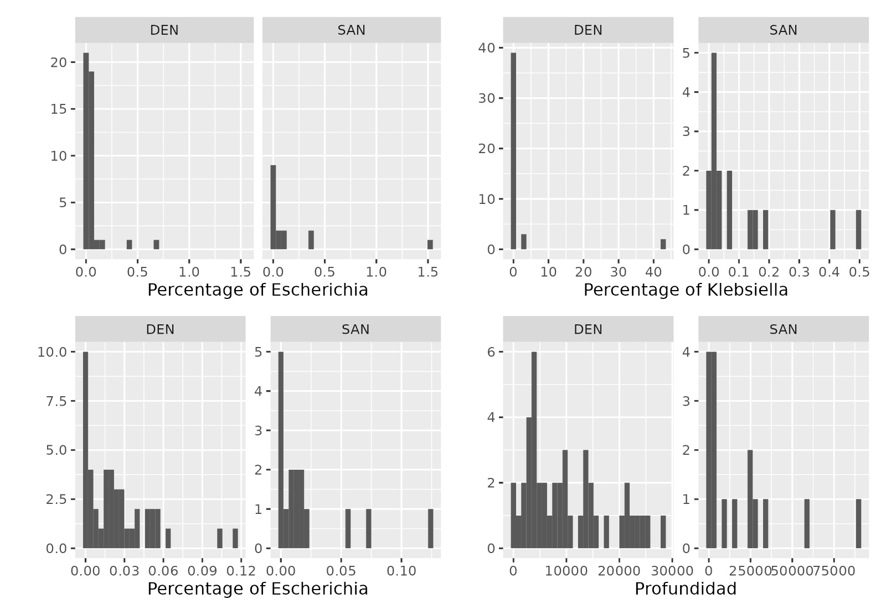

## Taxonomic assignation - Extraction by genus - City binning - Assembly - AMR identification
Alnitak   
[ ] CARD:   
Counts: /data/camda2023/extraction/extraction-amr-counts.tsv  (492 Ids some of them included in the mysterious sample)  
Presence_absence: /data/camda2023/extraction/extraction-amr-presence.tsv  
[ ] blastn     

In this pipeline, we first found reads taxonomy assignation using Kraken2, then, 
we extracted and binned all reads that belonged to the same city. Next, we run RGI
to predict the 180 CARD models that belong to the mysterious sample, and 
  

