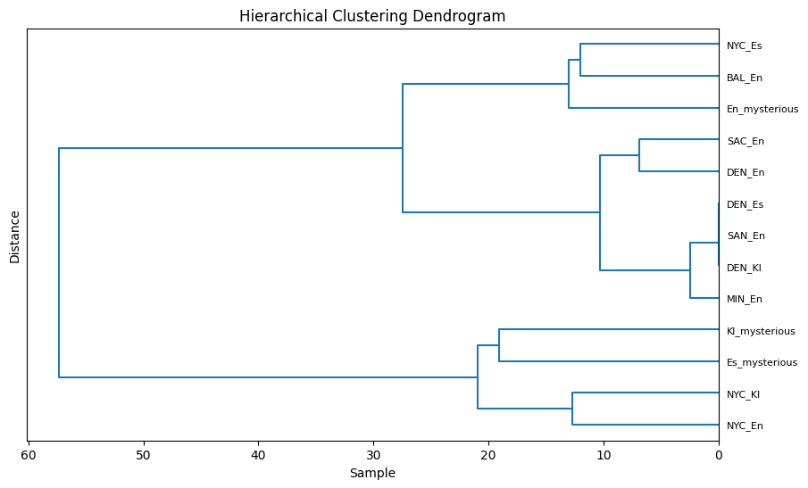
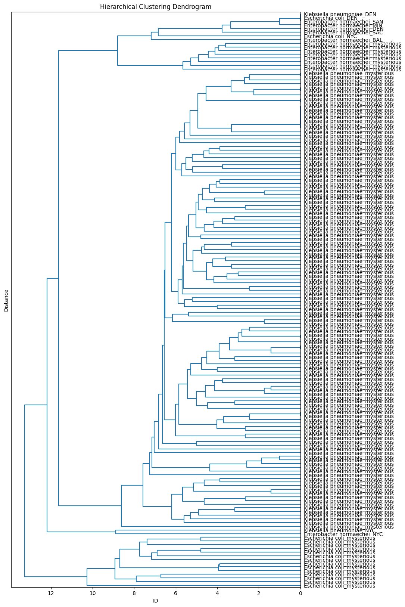

# Taxonomic assignation - Extraction by genus - City binning - Assembly - AMR 

## Data

Everything related to this pipeline can be found in Chihuil:
`/botete/mvazquez/camda2023/us-cities/`:

- `a1-reads-classification/` has Kraken outputs and reports from the reads.
- `a2-reads-extraction/` contains sequences that were classified as
_Escherichia_, _Enterobacter_ or _Klebsiella_, by Kraken.
- `a3-reads-assembly` has the assembled sequences by city and genus.
- `a4-reads-card/` stores RGI's outputs from the assembled extractions.
- `genus-list.txt` is the list of genera of interest.
- `city-list.txt` is the list of US cities.
- `reads-amr-counts.tsv` is the table of AMR gene counts by city and
genus from the reads. On GitHub, you can find it here:
[`230628_us_reads_card_counts.tsv`](https://github.com/ccm-bioinfo/cambda2023/blob/main/06_amr_resistance/data/230628_us_reads_card_counts.tsv)
- `reads-amr-presence.tsv` is the presence-absence table. On GitHub,
you can find it here:
[`230628_us_reads_card_presence.tsv`](https://github.com/ccm-bioinfo/cambda2023/blob/main/06_amr_resistance/data/230628_us_reads_card_presence.tsv)

## Steps

1. Define paths to the trimmed reads directory, the Kraken database, the
RGI database, the `extract_kraken_reads.py` script from
[KrakenTools](https://github.com/jenniferlu717/KrakenTools), and a directory
where contents will be saved.

```bash
set -e
readsdir="$HOME/camda2023/trimmed/"
krakendb="$HOME/camda2023/krakenDB/"
rgidb="$HOME/camda2023/localDB/"
extractor="$HOME/camda2023/krakentools/extract_kraken_reads.py"
currdir=$(pwd) # Or set to any directory where contents will be saved
```

2. Create symbolic links to the reads inside the `reads/` directory in
`${currdir}`.

```bash
mkdir -p reads
cd reads
parallel ln -fs {} {/} ::: ${readsdir}/*_{BAL,DEN,MIN,NYC,SAC,SAN}_*
cd ..
```

3. Create two list files, one with the list of cities, and another with the
list of genera.

```bash
echo {BAL,DEN,MIN,NYC,SAC,SAN} | tr ' ' '\n' > city-list.txt
echo En,Enterobacter,547 Es,Escherichia,561 Kl,Klebsiella,570 | tr ' ' '\n' \
  > genus-list.txt
```

4. Perform taxonomic classification with `kraken2`.

```bash
mkdir -p a1-reads-classification/

ls reads/*_1.fastq.gz | while read f1; do
  base=$(basename "${f1%%_1.fastq.gz}")

  if [[ ! -f "a1-reads-classification/${base}.output" ]] || \
     [[ ! -f "a1-reads-classification/${base}.report" ]]; then

    echo $(date +"%D %T:") ${base}

    kraken2 \
      --db ${krakendb} \
      --threads $(expr $(nproc) / 4 + 1) \
      --report a1-reads-classification/${base}.report \
      --output a1-reads-classification/${base}.output \
      --paired \
      --gzip-compressed \
      reads/${base}_1.fastq.gz reads/${base}_2.fastq.gz
  fi
done
```

5. Extract sequences that were classified as _Escherichia_, _Enterobacter_ or
_Klebsiella_.

```bash
mkdir -p a2-reads-extraction/

cat genus-list.txt | while read line; do

  genid=${line%%,*}
  genus=${line#*,}; genus=${genus%%,*}
  taxid=${line##*,}
  echo $(date +"%D %T:") Extracting ${genus} reads

  parallel -j $(expr $(nproc) / 4 + 1) \
    ${extractor} \
    -k a1-reads-classification/{}.output \
    -s reads/{}_1.fastq.gz \
    -s2 reads/{}_2.fastq.gz \
    -t ${taxid} \
    -o a2-reads-extraction/{}_${genid}_1.fq \
    -o2 a2-reads-extraction/{}_${genid}_2.fq \
    -r a1-reads-classification/{}.report \
    --include-children \
    --fastq-output \
    ::: $(ls a1-reads-classification/*.report | cut -f 2 -d '/' | cut -f 1 -d '.')

  echo $(date +"%D %T:") Finished extracting ${genus} reads
done
```

6. Assemble extracted sequences with `megahit`.

```bash
mkdir -p a3-reads-assembly/

cat city-list.txt | while read city; do

  cut -f 1 -d ',' genus-list.txt | while read genus; do

    if [[ ! -f a3-reads-assembly/${city}_${genus}.fa ]]; then

      echo $(date +"%D %T:") Assembling ${genus} of ${city}

      f1=$(ls a2-reads-extraction/*_${city}_*_${genus}_1.fq | paste -s -d ',')
      f2=$(echo ${f1} | sed -e "s/_1\./_2\./g")

      megahit -1 ${f1} -2 ${f2} -t $(expr $(nproc) / 4 + 1) \
        -o a3-reads-assembly/${city}_${genus} \
        --out-prefix ${city}_${genus} --tmp-dir tmp/

      mv -v a3-reads-assembly/${city}_${genus}/${city}_${genus}.contigs.fa \
        a3-reads-assembly/${city}_${genus}.fa
      rm -rf a3-reads-assembly/${city}_${genus}/
    fi
  done
done
```

7. Annotate assemblies with RGI.

```bash
mkdir -p a4-reads-card/
cd $(dirname ${rgidb})

parallel -uj $(expr $(nproc) / 48 + 1) rgi main --local --clean \
  -i ${currdir}/a3-reads-assembly/{/.}.fa \
  -o ${currdir}/a4-reads-card/{/.} \
  -a DIAMOND -n $(expr $(nproc) / 16 + 1) \
  --low_quality --include_nudge --include_loose \
  ::: ${currdir}/a3-reads-assembly/*.fa

cd ${currdir}
parallel mv {} {.}.tsv ::: a4-reads-card/*.txt
```

8. Create abundance and presence-absence tables with the
[`get-amr-counts.py`](https://github.com/ccm-bioinfo/cambda2023/blob/main/01_preprocessing/src/get-amr-counts.py)
script

```bash
python get-amr-counts.py a4-reads-card/*.tsv
mv amr-counts.tsv reads-amr-counts.tsv
mv amr-presence.tsv reads-amr-presence.tsv
```

9. **TODO**: BLAST for genes not in CARD.


In some cities, these organisms are among the low-abundance genus.  
  




